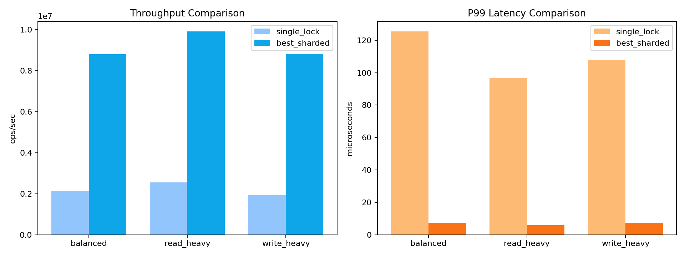
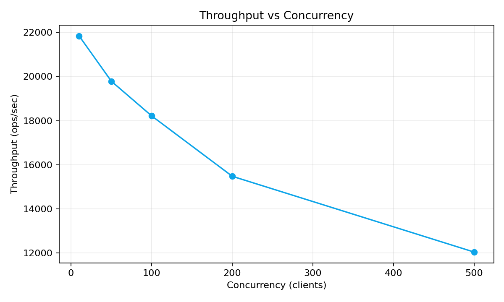
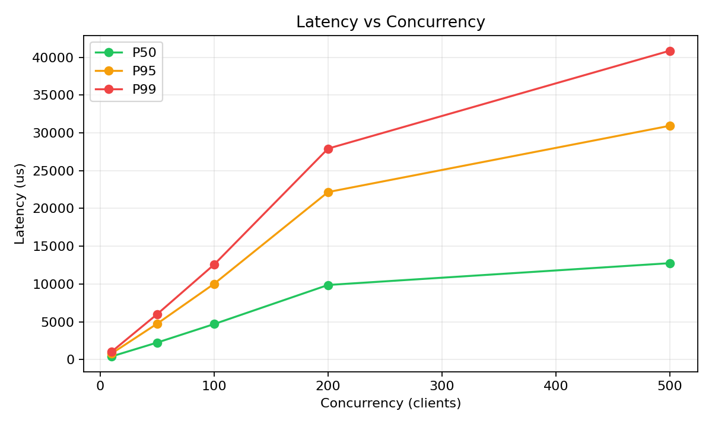
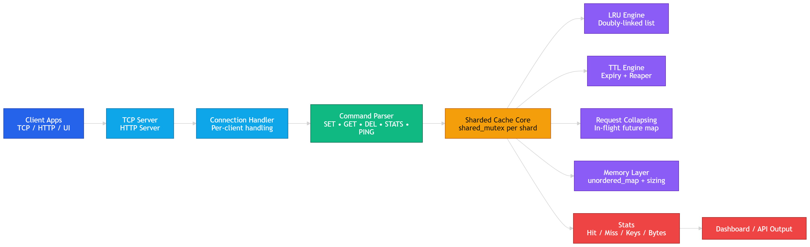

# Low-Level-Memory-Cache: Redis-Like In-Memory Cache Engine

A high-throughput, low-latency, thread-safe in-memory cache system built in C++17 with multiple interfaces, benchmark evidence, and deployment workflow.

## Demo and Write-up

- Project Demo Video: [Add YouTube/Drive link here](https://example.com/your-demo-video)
- Medium Blog Post: [Add Medium article link here](https://medium.com/@your-username/your-article)

---

## 1. What Is This?

This project is a Redis-inspired in-memory cache designed for systems-level performance and concurrency.

Core goal:
- Serve concurrent read/write traffic safely with predictable response behavior.
- Keep operations fast with O(1)-style hash-map/list primitives where possible.
- Provide measurable evidence (throughput and percentile latency) instead of claims.

This is not just a key-value map. It includes:
- concurrent sharded architecture
- LRU eviction
- TTL expiry
- thundering-herd protection
- TCP protocol server
- HTTP API and visual dashboard
- benchmark/graph generation
- CI and deployment automation

---

## 2. Features

### Concurrency and Correctness
- 64-way sharded cache design for reduced lock contention.
- Per-shard read/write lock strategy (`shared_mutex`) for multi-reader/single-writer behavior.
- Request collapsing for hot-expired keys using in-flight futures to avoid duplicate compute storms.

### Cache Policies
- LRU eviction when shard capacity is exceeded.
- TTL expiration with active checks and cleanup.

### Interfaces
- TCP server (Redis-like text commands): `SET`, `GET`, `DEL`, `STATS`, `PING`, `QUIT`.
- HTTP server endpoints for API usage.
- Built-in browser dashboard for visual operations and live stats.

### Observability
- Hit/miss counters and hit ratio.
- Active keys and memory usage estimate.
- Benchmark scripts with CSV + PNG graph output.

### Engineering Workflow
- CMake-based build.
- Unit and concurrency tests.
- Sanitizer jobs in CI.
- Docker packaging and EC2 deployment workflow with rollback script.

---

## 3. Benchmarks (With Graphs)

### A. Optimized Sharded Cache vs Single-Lock Baseline

Measured from tuned benchmark output:
- Balanced: throughput +313.0%, P99 latency -94.1%
- Read-heavy: throughput +287.7%, P99 latency -93.8%
- Write-heavy: throughput +355.9%, P99 latency -93.1%

Optimization comparison chart:



Visible summary (from CSV):

| Profile | Baseline (single_lock) ops/sec | Best Sharded Variant | Best Sharded ops/sec | Throughput Gain | Baseline P99 (us) | Best P99 (us) | P99 Reduction |
|---|---:|---|---:|---:|---:|---:|---:|
| balanced | 2,133,650.06 | sharded_32 | 8,811,036.31 | 313.0% | 125.40 | 7.40 | 94.1% |
| read_heavy | 2,557,721.01 | sharded_32 | 9,915,142.90 | 287.7% | 96.90 | 6.00 | 93.8% |
| write_heavy | 1,935,581.17 | sharded_32 | 8,824,026.84 | 355.9% | 107.60 | 7.40 | 93.1% |

CSV sources:
- [docs/graphs/optimization_comparison.csv](docs/graphs/optimization_comparison.csv)
- [docs/graphs/tuned_benchmark_raw.csv](docs/graphs/tuned_benchmark_raw.csv)

### B. TCP Mixed-Workload Scaling Sweep

From generated concurrency sweep:
- concurrency 10: 21,844.92 ops/sec, P99 1,040.20 us
- concurrency 50: 19,786.86 ops/sec, P99 6,009.90 us
- concurrency 100: 18,213.87 ops/sec, P99 12,577.00 us
- concurrency 200: 15,472.89 ops/sec, P99 27,919.90 us
- concurrency 500: 12,033.42 ops/sec, P99 40,874.80 us

Throughput chart:



Latency percentile chart:



Visible summary (from CSV):

| Concurrency | Throughput (ops/sec) | P50 (us) | P95 (us) | P99 (us) |
|---:|---:|---:|---:|---:|
| 10 | 21,844.92 | 419.00 | 804.30 | 1,040.20 |
| 50 | 19,786.86 | 2,251.80 | 4,752.50 | 6,009.90 |
| 100 | 18,213.87 | 4,698.70 | 10,030.10 | 12,577.00 |
| 200 | 15,472.89 | 9,873.70 | 22,169.70 | 27,919.90 |
| 500 | 12,033.42 | 12,758.40 | 30,942.30 | 40,874.80 |

CSV source:
- [docs/graphs/concurrency_sweep.csv](docs/graphs/concurrency_sweep.csv)

Interpretation:
- Throughput degrades gracefully as concurrency rises.
- Tail latency (P95/P99) increases at high client counts, showing realistic contention/scheduling effects.
- No transport/protocol errors in measured runs.

---

## 4. Design Decisions and Trade-Offs

### Why Sharding + RW Locks?
- Single global lock is simple but becomes a bottleneck under mixed load.
- Sharding localizes contention and allows independent progress across buckets.
- RW locks improve read-heavy parallelism while preserving write safety.

Trade-off:
- More complex implementation than a global mutex.
- Cross-shard global ordering is not provided by default.

### Why LRU?
- LRU approximates recency-based usefulness and is practical for many cache workloads.
- Hash map + linked list gives efficient update/evict behavior.

Trade-off:
- Strict global LRU is expensive in a sharded design; this project uses per-shard LRU.

### Why TTL?
- Supports freshness and bounded staleness for cached items.
- Enables safe auto-expiry for session/token-like data.

Trade-off:
- Expiry checks and cleanup add overhead.
- Exact expiration instant can depend on access/cleanup timing.

### Why Request Collapsing?
- Prevents thundering-herd effect when many clients miss the same hot key simultaneously.
- Ensures one compute path per key while others wait for the same result.

Trade-off:
- Additional in-flight bookkeeping.

---

## 5. Architecture

Diagram - LLMC flowchart:



High-level flow:
- Client -> TCP/HTTP server -> Connection handler -> Command parser -> Sharded cache core
- Sharded core -> LRU engine, TTL engine, request-collapsing map, memory layer
- Stats exported to API/UI

---

## 6. How To Run

### Local Build (Windows, Visual Studio generator)

```powershell
cmake -S . -B build -G "Visual Studio 18 2026"
cmake --build build --config Release --parallel
```

### Run Tests

```powershell
ctest --test-dir build -C Release --output-on-failure
```

### Run Tuned Benchmark

```powershell
./build/Release/cache_benchmark.exe
```

### Run HTTP UI

```powershell
./build/Release/cache_http.exe 8080 50000
```

Open:
- http://127.0.0.1:8080/

### Run TCP Server

```powershell
./build/Release/cache_tcp_server.exe 6379 50000
```

### Run Python TCP Benchmark

```powershell
python .\benchmark.py --host 127.0.0.1 --port 6379 --requests 100000 --concurrency 50 --mode mixed --get-ratio 0.70 --set-ratio 0.25 --key-space 20000
```

### Generate Graph Artifacts

```powershell
python .\scripts\generate_benchmark_artifacts.py --project-root . --tuned-output benchmark_output.txt --out-dir docs/graphs --run-sweep --server-exe build/Release/cache_tcp_server.exe --requests 20000 --mode mixed --get-ratio 0.70 --set-ratio 0.25 --key-space 20000 --concurrency-list 10,50,100,200,500
```

---

## 7. Deployment (AWS EC2 + Nginx + Docker)

Current deployment model:
- EC2 t2.micro instance
- Nginx reverse proxy
- Dockerized service
- GitHub Actions deploy workflow
- rollback-capable release script

Key files:
- [deploy/README.md](deploy/README.md)
- [Deploy_Readme.md](Deploy_Readme.md)
- [docker-compose.yml](docker-compose.yml)
- [Dockerfile](Dockerfile)
- [.github/workflows/deploy-ec2.yml](.github/workflows/deploy-ec2.yml)

---

## 8. Tech Stack

- Language: C++17
- Core concurrency: `thread`, `shared_mutex`, `atomic`, futures
- Data structures: `unordered_map`, linked-list-based LRU
- Build: CMake
- Testing: GoogleTest
- APIs: TCP sockets + cpp-httplib
- Visualization: Python + matplotlib
- Containerization: Docker
- Deployment: AWS EC2 + Nginx + GitHub Actions

---

## 9. Interviewer-Focused Talking Points

- Designed for lock-contention reduction using sharding and per-shard RW synchronization.
- Implemented thundering-herd protection with in-flight request collapsing.
- Measured and published throughput/tail-latency improvements with graph artifacts.
- Built both protocol-level (TCP) and service-level (HTTP + UI) interfaces.
- Containerized and deployed on EC2 with CI/CD and rollback automation.

---

## 10. Repository Proof Checklist

For review/demo, include these artifacts:
- benchmark outputs (`benchmark_output.txt`, `tcp_benchmark_output.txt`)
- graph files in [docs/graphs](docs/graphs)
- architecture diagram in [docs/architecture_diagram.md](docs/architecture_diagram.md)
- deployment docs in [deploy/README.md](deploy/README.md)
