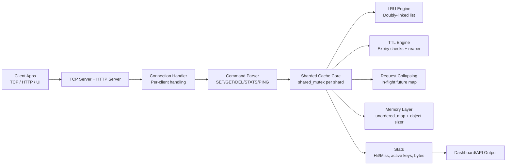

# Architecture Diagram

## Notes

- Fine-grained concurrency is achieved via sharding and per-shard reader-writer locking.
- LRU and TTL run as cache logic, while storage remains hash-map/list backed.
- Request collapsing ensures only one in-flight compute for hot-expired keys.
